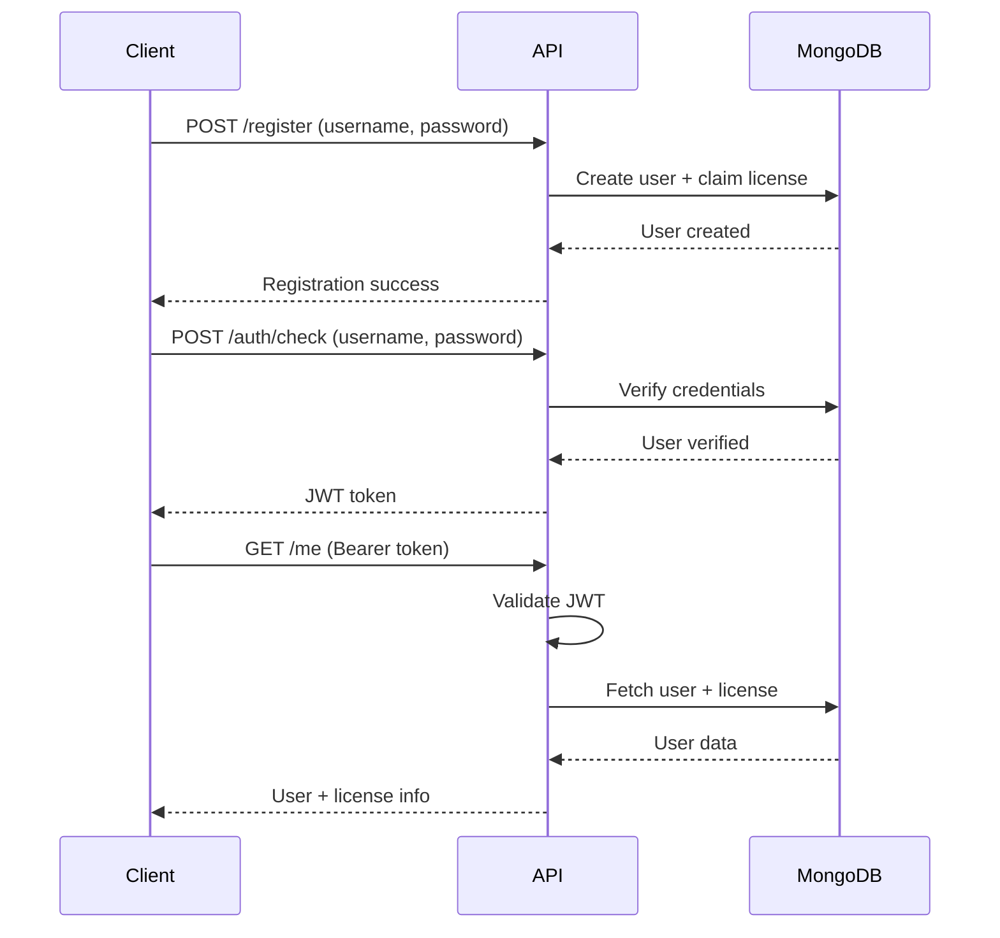

# AuthLicensing API + Client

A lightweight **authentication and licensing API** built with **.NET 8**, **MongoDB**, and **JWT tokens**, featuring **Swagger UI** and a **WinForms test client** for demonstrating secure authentication flows.

---

## CI/CD Pipeline

This repository features **fully automated deployment** to Azure using GitHub Actions:

1. **Build**: Docker image created from `.NET 8` project on every push to `main`
2. **Push**: Image tagged with `latest` and commit SHA, pushed to Docker Hub
3. **Deploy**: Azure login via OpenID Connect (OIDC)
4. **Provision**: Automatic creation/update of Azure Container App environment
5. **Run**: Container exposed on port 5080 with public HTTPS endpoint

**Zero-manual deployment** — every commit triggers a clean, repeatable release directly to Azure Container Apps.

> 🌐 **[Try it Live - hosted on Azure!](https://auth-licensing-api.thankfulfield-6841e884.westeurope.azurecontainerapps.io/index.html)**

You can use test licenses in format "KEY-X" from 1 to 100 when registering/logging in.
---

## Key Features

### JWT Authentication
- Secure short-lived access tokens with expiration and signature validation
- Issuer/audience verification using `JwtBearer`
- Token-based authorization for protected endpoints

### MongoDB Integration
- Collections for `users` and `licenses`
- Atomic license claiming with duplicate prevention
- Efficient document-based storage

### Security
- **Password Hashing**: Salted hashes with adjustable BCrypt work factor
- **Rate Limiting**: Protection against brute-force attacks on `/auth/check` and `/register`
- **Correlation IDs**: Unique request tracking for debugging and monitoring

### Structured Logging with Serilog
JSON and console logs with detailed request information:
```
[21:42:53 INF] (cid=91247fd1...) HTTP POST /auth/check => 200 (214 ms)
[21:58:01 INF] (cid=a3f0f3b2...) Authorization failed: Requires an authenticated user.
```

Each log entry includes:
- Timestamp
- Correlation ID (cid)
- Username (if available)
- Endpoint path
- HTTP status code
- Response time

### Application Insights Integration
Comprehensive telemetry and monitoring for Azure deployments:

**Automatic Tracking:**
- Request telemetry (response times, status codes)
- Dependency tracking (MongoDB calls)
- Exception logging
- Custom events and metrics

**Serilog Integration:**
- All Serilog logs automatically sent to Application Insights
- Structured logging with correlation IDs
- Exception tracking with full stack traces

### Swagger / OpenAPI Documentation
Interactive API documentation with built-in JWT authorization testing


---

## API Endpoints

| Method | Path | Description | Auth Required | Rate Limited |
|--------|------|-------------|---------------|--------------|
| `POST` | `/register` | Register new user (optionally claim license key)
| `POST` | `/auth/check` | Authenticate and issue JWT token
| `GET` | `/me` | Get current user + license information 

---

## Authentication Flow



### How It Works

1. **Register**: Client calls `/register` with username and password
2. **Login**: Client authenticates via `/auth/check` 
3. **Token**: Server verifies credentials - returns JWT token
4. **Authorize**: Client includes token in `Authorization: Bearer <token>` header
5. **Access**: Protected endpoints validate token before processing

---

## WinForms Authentication Client

A C# WinForms application demonstrating full API integration:

### Features
- **Register** new users
- **Login** securely with `/auth/check`
- **Auto-store** and attach Bearer token
- **Authenticated Window** that:
  - Fetches user data from `/me`
  - Displays user and license information
  - Validates token expiry before requests

> The `/me` endpoint only works while the access token is valid.

---

## Tech Stack

- **.NET 8** - Modern web API framework
- **MongoDB** - Document database for users and licenses
- **JWT (JSON Web Tokens)** - Secure authentication
- **Serilog** - Structured logging
- **Swagger/OpenAPI** - Interactive API documentation
- **BCrypt** - Password hashing
- **Docker** - Containerization
- **Azure Container Apps** - Cloud hosting
- **GitHub Actions** - CI/CD automation

---

## Unit Testing

Unit tests using **xUnit** and **.NET 9**:

- **RegistrationEndpointTests**: User registration, license claiming, duplicate prevention, BCrypt security
- **AuthenticationEndpointTests**: JWT generation, password validation, license verification, token handling
- **UserProfileEndpointTests**: Profile retrieval, subscription levels, token expiry, claims validation

**Key Features:**
- Real MongoDB integration with isolated test databases
- Security testing (BCrypt hashing, JWT validation)
- Comprehensive edge case coverage

---

## Getting Started

### Prerequisites
- .NET 8 SDK
- MongoDB instance
- Docker (for containerization)

### Local Development

1. Clone the repository

2. Update `appsettings.json` with your MongoDB connection string and JWT settings

3. Run the API
    **Linux/macOS:**
   ```bash
   dotnet run --project AuthLicensingApi
   ```

   **Windows (PowerShell/CMD):**
   ```cmd
   dotnet run --project AuthLicensingApi
   ```

   Or simply navigate to the project folder and run:
   ```cmd
   cd AuthLicensingApi
   dotnet run
   ```

4. Access Swagger UI at `http://localhost:5080/swagger`

---

## License

This project is open source and available under the [MIT License](LICENSE).
